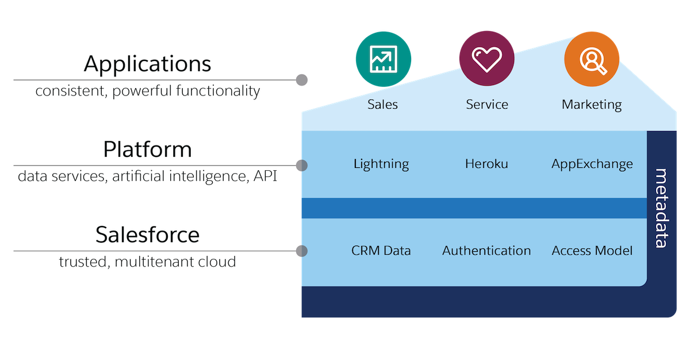

# Salesforce 是什么?

Salesforce 是一款基于云计算的企业级客户关系管理 (CRM) 软件，旨在帮助您的销售、服务、营销、分析以及与客户联系。

Salesforce 提供了一个平台，在其中企业可以跟踪销售、服务、营销和客户参与。它提供了一个全面的解决方案，包括数据分析、个性化营销、促进销售, 管理客户信息以及支持团队协作等功能。该软件不仅能够为企业提高效率，还能够更好地满足客户需求并提供更好的体验。

Salesforce 建立在云计算技术之上，使得用户可以随时随地访问该软件，并具有高可扩展性和安全性。它是一种按需付费的软件，可以根据企业的独特需求来定制和配置，从而实现最大化的价值.

# 为什么要使用 Salesforce? 或者说使用 Salesforce 有什么优势?

我个人认为使用 Salesforce 的优势有很多, 下面我列举了一些主要的优势:

- 增加销售机会：Salesforce 能够跟踪和管理潜在客户和现有客户，提供所有利用这些数据的信息，以增加销售机会并改善销售业绩。
  
- 提高工作效率：Salesforce 通过一些自动化流程、分配规则等方式提高团队协作，减少手动工作量，从而节省时间、精力和资源。
  
- 便于数据分析：Salesforce 能够收集和分析数据，并将结果呈现为报告和图表，帮助企业对数据进行深入分析，为企业决策提供更准确的数据支持。
  
- 业务灵活性: Salesforce 平台允许用户自定义各种业务流程、数据模型、用户权限和界面等。这些灵活性使得 Salesforce 能够适应各种不同类型的企业和行业，并且能够满足不同用户的需求。
  
- 灵活的付费模式: Salesforce 按需付费模式是一种基于云计算的订阅模式，用户只需按照自己的实际需求付费，并且可以根据业务需要随时进行扩容或缩减。这种模式与传统软件许可证模式不同，传统模式通常需要购买软件许可证和硬件设备来安装和维护软件，而按需付费模式则完全无需考虑这些成本.

# Salesforce 的架构

	

从上图中我们可以了解到, Salesforce 的整体架构是分布在云端的多层服务, 

- 应用层：Salesforce 应用层包括 Sales Cloud、Service Cloud、Marketing Cloud、Commerce Cloud 等各种云应用。每个云应用都有专门的功能和特点，可以满足不同业务领域的需求。

- 平台层：Salesforce 平台层包括 Force.com 平台和 Heroku 平台。Force.com 平台是一种基于云的开发平台，可以帮助企业快速构建自定义应用程序。Heroku 平台则提供了一种基于云的应用托管方案，可以让企业轻松地将应用程序部署到云端。 Salesforce 提供了多种集成方式，包括 RESTful API、SOAP API、BULK API、Streaming API 等。这些 API 可以让企业将 Salesforce 应用程序与其他系统集成起来，实现数据的交换和共享。

- Salesforce: 一个多租户平台, 包括核心数据库、元数据数据库等。这些数据库存储着 Salesforce 平台和应用程序所需的所有数据。另外 Salesforce 还包括多种安全措施，如身份验证、访问控制、审计、防火墙等，可以保护 Salesforce 平台和应用程序免受安全威胁。